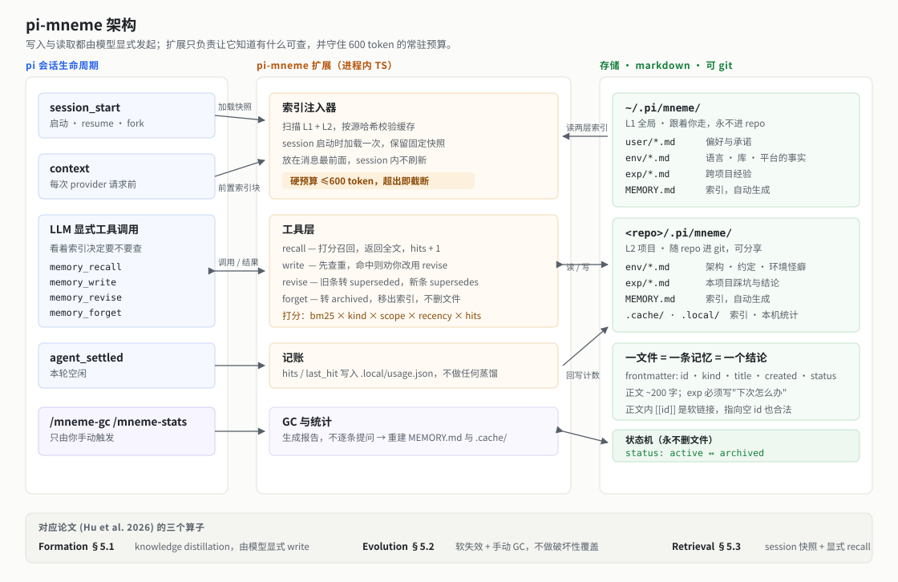
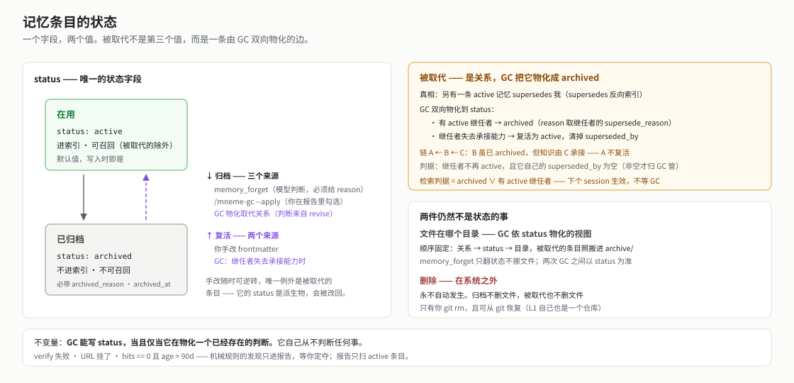

# pi-mneme 设计

pi 的长期记忆扩展。让 pi 跨会话记住三件事：**你是谁**（偏好与承诺）、**这个代码库是什么样**（架构、约定、环境怪癖）、**上次踩过什么坑**（可复用的经验结论）。

设计参照 Hu et al., *Memory in the Age of AI Agents: A Survey* (arXiv 2512.13564v2)，下称"论文"。



---

## 1. 范围

**做：**
- 三类长期记忆：user factual / environment factual / experiential(insight)
- 人类可读的 markdown 存储，可 diff、可手改、可进 git
- 记忆操作作为 LLM 显式 tool call
- 每个 session 启动时在消息前部注入一份轻量索引快照，让模型知道有什么可查

**v1 明确不做，及理由：**

| 不做 | 理由 |
|---|---|
| Working memory（上下文折叠/压缩） | pi 已有 compaction 机制（`session_before_compact`）。这是独立的工程问题，硬塞进来会让 v1 无法收敛。挂钩点留着，见 §9 M3。 |
| Parametric / latent memory（论文 3.2 / 3.3） | 需要训练或改推理栈，与"可读、可审计"的目标直接冲突。 |
| 图结构记忆（论文 3.1.2 / 3.1.3） | 构建与维护成本高，且论文自己指出 planar memory 的搜索成本"significantly hinder its practical deployment"。先用 flat + `[[id]]` 弱关联，等召回质量确实不够再上。 |
| Skill-based memory（可执行脚本，论文 4.2.3） | 引入执行安全、版本、失效检测一整套问题。pi 已有 skills 机制可以承接。 |
| 自动写入（会话结束蒸馏 / 离线 consolidation） | 见 §8。触发权保留给你。 |

---

## 2. 论文映射

| 论文维度 | 选择 | 理由 |
|---|---|---|
| **Form** (§3) | Token-level, **1D flat** + `[[id]]` 弱关联 | 可读、可 git、可手改。论文 §3.1.1 讨论：flat 的代价是"coherence and relevance depend heavily on retrieval quality"——所以检索质量是本设计的主要风险点，见 §7 和 §10。 |
| **Function** (§4) | Factual(user + environment) + Experiential(insight) | 覆盖 coding agent 收益最大的三块。 |
| **Formation** (§5.1) | Knowledge distillation，由 LLM 显式调用 | 不做 semantic summarization（会丢细节）。一条记忆 = 一个可独立成立的结论。 |
| **Evolution** (§5.2) | 软失效 + 手动 GC | 论文 §5.2.2 指出早期系统（MemGPT/Mem0）的 destructive replace "erasing valuable historical context and breaking temporal continuity"；Zep 改用时间戳软失效。我们照 Zep 的思路，且 git 本身就是历史。 |
| **Retrieval** (§5.3) | session 启动时加载索引快照 + 显式 `memory_recall` | 论文 §7.2 主张把记忆操作变成 agent 的显式 tool call，理由是可解释、可追溯、行为一致。前置索引是对 §5.3.1 提到的 silent failure mode 的对冲，见 §6.1。 |

---

## 3. 条目状态

一条记忆的一生只有一个状态字段，两个取值。被取代不是第三个取值，而是一条通往 `archived` 的边——真相是关系，`status` 是 GC 依关系物化出来的视图。另外两件看着像状态的事——在哪个目录、被删掉——则完全不是状态。§3.1 先把状态机原样列出来，§3.2 起逐条解释它为什么长这样。这一节排在存储之前，因为 frontmatter 里好几个字段只有在这个模型下才讲得通。



### 3.1 状态机

**状态**（`status` 字段，无中间态）：

| 值 | 索引与检索 | 必备字段 |
|---|---|---|
| `active` | 进索引、可召回，**除非**被一条 `active` 记忆取代（见下方不变量） | —（写入时的默认值） |
| `archived` | 不进索引，不可召回；文件仍在 | `archived_reason`、`archived_at` |

**转移**：

| 边 | 触发者 | 条件 | 同时写入 |
|---|---|---|---|
| `active → archived` | `memory_forget` | 模型判断该忘掉，必须给 `reason` | `archived_reason = reason`；`archived_at = now` |
| `active → archived` | `/mneme-gc --apply` | 你在 GC 报告里勾选 | `archived_reason`；`archived_at = now` |
| `active → archived` | `/mneme-gc`（自动，A 步骤 1） | 存在一条 `active` 记忆 `supersedes` 它 | `archived_reason = "被 <new-id> 取代：<supersede_reason>"`；`archived_at = now`；`superseded_by = <new-id>` |
| `archived → active` | `/mneme-gc`（自动，A 步骤 1） | `superseded_by` 非空，且该继任者不再 `active`、其自身 `superseded_by` 为空 | 清空 `archived_reason`、`archived_at`、`superseded_by` |
| `archived → active` | 你手改 frontmatter | 无 | 由你清空 `archived_reason`、`archived_at` |

**不构成转移的事件**：

| 事件 | 实际发生的事 |
|---|---|
| `memory_revise` 取代一条记忆 | 只往旧条目写 `superseded_by`，`status` 不动——它从下一个 session 的索引与检索快照中退出（判定见下方不变量）；字段改成 `archived` 要等下一次 GC（§3.3） |
| GC 清理 `active` 条目的失效 `superseded_by` | 只清物化标记，`status` 不动——继任者在首次 GC 前已失去承接能力时，旧条目本来就是 `active`，无需“复活”（§3.3） |
| `verify` 失败、URL 挂掉、`hits == 0 且 age > 90d` | 只进 GC 报告，等你定夺（§8 B 组） |
| GC 在 `archive/` 与 kind 目录之间搬文件 | `status` 的下游物化，不是它的输入（§3.4） |
| `git rm` 一个条目 | 在状态机之外，文件消失，没有状态迁移（§3.5） |

**不变量**：

- **不进索引、不进检索 ⟺ `status: archived` ∨ 存在一条 `active` 记忆 `supersedes` 它。** 两个析取项缺一不可：字段是持久真相，反向索引推导在 session 启动时构建快照。取代关系不等 GC 物化就会进入下一个 session 的快照（§3.3、§7）。
- 任何 `archived` 条目必有非空 `archived_reason` 和 `archived_at`；两者随状态一起写、一起清。
- 对一个 `archived` 条目：`superseded_by` 非空 ⟺ 这个 `archived` 由取代关系物化而来，GC 可以撤销它；为空则 GC 永不改写它的 `status`。（`active` 条目也可能带着 `superseded_by`——那是 revise 之后、GC 之前的样子。）
- 归档不删文件，被取代不删文件。删除只由 `git rm` 发生。

### 3.2 谁配写 `archived`

每条边都是同一个字段的整体赋值，没有中间态——所以手改 frontmatter 随时可以逆转任一方向，不需要任何撤销机制。"markdown 可手改"这条目标在状态机上就兑现为这一句。唯一的例外是被取代的条目，它的 `status` 是派生物，手改会被下次 GC 改回去（§3.3 末）。

**界线在哪。** 界线不是"自动 vs 手动"——`memory_forget` 由模型自行调用，没有你的批准，它当然是自动的。界线是这个 `archived` 背后有没有一次针对内容的判断：

- **对这条记忆内容的判断**（可以写 `archived`）：读过它，认为它错了、过时了、或已被另一条写得更好的记忆取代，且必须留下理由。`memory_forget` 的 `reason` 和 `memory_revise` 的 `supersede_reason` 都是这样的理由。
- **机械规则的副产品**（一律不能写状态）：`verify` 失败只标"待核"；URL 内容判断只标"待核"；`hits == 0 且 age > 90d` 只让它进候选列表。

GC 物化取代关系时写的 `archived` 属于第一类：判断发生在 `memory_revise` 那一刻，模型读过旧条目、写出了继任者、给了 `supersede_reason`；GC 只是把这个判断落到字段上，自己不产生任何新判断。这条界线因此没有松动——**GC 能写 `status`，当且仅当它在物化一个已经存在的判断。**

`archived` 的语义是"有人判断过这条不该再存在"。一旦机械规则能写它，这个语义即刻作废。也正因为它只由判断产生，才配当一个存储状态。

**归档是不对称的，所以必须可复查。** 模型写错一条记忆，你迟早会读到并改掉；模型误归档一条好记忆，你收不到任何信号，只会觉得它"最近好像不太记得那件事了"——这是 §10 那个 silent failure 的另一副面孔。这里不加人工确认（会违背显式 tool call 路线，且 print / RPC 模式无法弹窗），改为保证出口：`archived_reason` 强制、文件永不删除、git 有记录，且 `/mneme-stats` 与 `/mneme-gc` 都要列出最近归档的条目及其理由。

### 3.3 被取代：是关系，由 GC 物化成 `archived`

**真相是关系**：存在另一条 `active` 记忆 `supersedes: X`，则 X 已被取代。这条关系由反向索引判定，反向索引本来就要为 `because` 而建（§4.2.2），增量成本为零。

**状态是物化**：`/mneme-gc` 依这条关系双向写 X 的 `status`——

- X 有 `active` 继任者，而 X 仍是 `active` → 置 `archived`，`archived_reason` 写"被 `<new-id>` 取代：`<supersede_reason>`"，`archived_at` 取当前时刻，并确保 `superseded_by: <new-id>`；
- X 是 `archived`、`superseded_by` 非空，而继任者已**失去承接能力** → 复活为 `active`，清掉 `archived_reason`、`archived_at` 和 `superseded_by`。
- X 仍是 `active`、`superseded_by` 非空，而继任者已**失去承接能力** → `status` 不动，只清掉失效的 `superseded_by`。这是 revise 后首次 GC 之前继任者就被 forget 或消失的情况；X 从未物化成 `archived`，所以无需复活。

"失去承接能力"要顺着取代链判，不能只看继任者是不是 `active`。链 A ← B ← C（C 取代 B，B 取代 A）里 B 必然是 `archived`，但知识由 C 承接着，A 不该复活。判据是**继任者不再 `active`，且它自己的 `superseded_by` 为空**——即它是被 `memory_forget` 归档的、或者文件根本不在了，链到此为止，没有下一棒。继任者若也是因取代而归档，跳过它，A 保持 `archived`。这条判据与 `memory_forget` 那句提示（本节下文）严丝合缝：归档一条 `supersedes` 了别人的记忆，恰恰就是把链掐断，前任因此复活。

这与 §3.4 的目录搬运是同一个模式，连"必须双向"的理由都一样：少了反向那一半，继任者一消失，前任就永久停在 `archived`，而没有任何继任者顶上——那条知识就静默消失了。

**推导在下一个 session 加载时生效，物化由 GC 随后收敛。** 检索的排除判据是析取的：`status: archived` **或**存在 `active` 继任者（§3.1 不变量）。第二个析取项不能省——GC 是手动低频操作，`.cache/` 则在每次 session 启动时比较记忆源哈希并在不一致时重建（§6.1），两者之间可以隔几周。省掉推导就意味着这几周里旧条目仍会和继任者一起进入新 session 的候选集。本设计不处理同一 session 内记忆变更后的索引与检索刷新；`memory_write` / `memory_revise` / `memory_forget` 只负责落盘，变更从下一个 session 起可见。

**那物化 `status` 买到了什么。** 不是简化读取路径——推导仍在。买到的是另外四样：

1. **`archive/` 目录容得下它。** 目录位置依 `status` 物化（§3.4），字段不翻，被取代的条目就永远混在 `user/` `env/` `exp/` 里。你打开 kind 目录看到的应该是"在用的"，这是本设计第一目标的直接要求。
2. **人读单个文件时不必 grep。** `status: archived` + `archived_reason: 被 X 取代` 摆在 frontmatter 里，不用为了搞清"这条还算数吗"去全库找 `supersedes: foo`。
3. **GC 报告的扫描范围自动收窄。** B 组只扫 `active`（§8）。被取代的条目 `hits` 从此不可能再涨，留在 `active` 里就会在 90 天后必然落入"久未命中"组。
4. **git 里留下痕迹。** 退休这件事进了 commit，而不只是每次重建索引时凭空推导一遍。

代价是同一个事实存在两处，可能不一致。这份设计一路用同一招处理这件事：**上游是真相，下游是物化，消费者各取所需，GC 负责收敛。**

**继任者消失不是罕见情况**：切分支（L2 随 repo 走，你在 feature 分支上 revise 的继任者，切回 main 就不存在）、`git revert` 或合并时被丢弃、继任者自己被归档。上面第二条规则正是为它们准备的。最后一种还要额外防一手：你以为整个话题都不要了，归档了当前这条，结果前任被 GC 复活。所以 `memory_forget` 一条 `supersedes` 了别人的记忆时，必须先说明"归档它会让 `<前任 id>` 在下次 GC 时复活"，由模型决定是否连前任一起归档。不静默复活。

**`superseded_by` 因此升级成了判据。** 光看 `status: archived` 分不出这条是被 `memory_forget` 归档的（GC 绝不能碰）还是被取代归档的（GC 该在继任者消失时复活它）；`superseded_by` 非空就是这个区分。它同时仍是给人看的标记——人打开 `exp/foo.md` 能直接看见自己被谁取代了，不必 grep 整个库找 `supersedes: foo`。所以 `memory_revise` 当场就往旧文件写 `superseded_by: <new-id>`，不等 GC。

它不再是"烂掉也无所谓"的装饰，规则收紧为两条：反向索引永远是真相，标记与推导冲突时推导赢；GC 发现失效的 `superseded_by`（继任者已不存在或已失去承接能力）时必须清理。若旧条目已是 `archived`，则**先复活再清标记**——顺序反了会把一条没有继任者的记忆永久留在 `archived`；若旧条目仍是 `active`，直接清标记即可。

**三层链条，各自的滞后各自认。** 关系 → `status` → 目录，每一层都是上一层的滞后物化，而每一层的消费者只认自己够得着的那层真相：

| 消费者 | 认哪一层 | 滞后 |
|---|---|---|
| 检索与索引构建 | 关系（析取判据，§3.1） | 到下一个 session 启动 |
| 人读单个文件、GC 报告分组 | `status` 字段 | 到下次 GC |
| 人浏览目录 | `archive/` 的位置 | 到下次 GC |

所以 `memory_revise` 不当场改 `status` 不构成正确性问题：索引与检索明确容忍到下一个 session 的滞后，后两行则本来就容忍到下次 GC 的滞后（§3.4 那句"跑之间以 `status` 为准"是同一个意思）。

**代价：手改被取代条目的 `status` 无效。** 它是派生物，你改成 `active`，下次 GC 又依关系改回 `archived`（§3.2 开头那句"随时可逆转"的唯一例外）。要真正复活一条被取代的记忆，得动继任者——删掉继任者的 `supersedes` 字段，或者把继任者归档。

这与 `archive/` 目录是同一个模式：**派生是真相，物化是给人看的，只有 GC 负责让两者收敛。**

### 3.4 目录位置：是 GC 物化的视图

`status` 是真相，`archive/` 目录是它的物化。`memory_forget` 只翻 `status`，不动文件位置——快、可逆、不在会话中途制造路径变更；`/mneme-gc` 本来就要重建索引与缓存，顺手依 `status` 把文件搬到位，双向搬（规则见 §4.2.3）。

之所以不让 forget 当场移动：那样"这条记忆是否还在用"就同时由目录和 `status` 表示，两个真相源会打架。因为 GC 是唯一动布局的地方，每次跑完两者按构造一致；跑之间以 `status` 为准。

被取代的条目**照搬不误**——GC 在同一趟里先依关系物化 `status`（§3.3），再依 `status` 物化位置，所以它归档后一并进 `archive/`；继任者哪天消失，也是先复活成 `active`、再被搬回 kind 目录。两步的顺序是固定的：**关系 → `status` → 目录**，`status` 在中间既是前一步的产物又是后一步的输入。

### 3.5 删除：在系统之外

永不自动发生。归档不删文件，被取代也不删文件；删除只有你 `git rm`。

注意不要用"保留历史"来论证保留文件：git 已经存了历史，`git log --diff-filter=D` 就能翻出被删的条目。那句话其实论证了删除是**安全的**。真正的理由是删除会引入三处边界情况，而它们都是前两节刚消掉的：

1. **链悬空。** 新条目的 `supersedes: <old-id>` 指向不存在的 id——而 §8 正把这个列为 GC 要抓的缺陷。
2. **复活失效。** "继任者消失则前任复活"这条规则（§3.3），前提是前任的文件还在。
3. **翻旧版的成本。** 从"打开文件"变成"翻 git log 找到那次删除"。

而收益只有磁盘和噪声。一条记忆约 1 KB，一千条被取代的记忆是 1 MB——**存储从来不是这个决定的变量**；噪声则已由 `archive/` 目录解决。拿三处边界情况换 1 MB，不划算。

**真要清理时，该删的是 `archive/` 里带 `superseded_by` 的那些，不是另一半。** 两者现在同处一个目录，但"删掉会失去什么"根本不同：带 `superseded_by` 的有继任者，知识还在，删掉只损失措辞；不带的没有继任者，是有人明确判断过不该再存在的，删掉这条知识就真的消失了。直觉容易反过来——后者听起来才像"你说过不要的东西"。

---

## 4. 存储

### 4.1 三层作用域

```
~/.pi/mneme/                     # L1 全局（永不进 repo）
  user/*.md                      #   user factual：你的偏好、习惯、长期承诺
  env/*.md                       #   全局 environment factual：语言/库/平台的事实
  exp/*.md                       #   跨项目经验：与具体 repo 无关的通用结论
  archive/                       #   已归档，GC 挪进来，不进索引不进检索
  MEMORY.md                      #   L1 索引
  .cache/                        #   派生索引，可重建
  .git/                          #   L1 自成一个本地仓库，见 §4.2.3

<repo>/.pi/mneme/                # L2 项目内（随 repo 进 git）
  env/*.md                       #   项目 environment factual：架构、约定、构建命令、环境怪癖
  exp/*.md                       #   本项目经验：踩坑与结论
  archive/                       #   已归档，GC 挪进来
  MEMORY.md                      #   L2 索引
  .cache/                        #   gitignore
```

### 4.1.1 scope × kind 矩阵

`scope` 回答"换个 repo 还成立吗"，`kind` 回答"这是什么性质的知识"。两者正交：

| | `kind: user` | `kind: env`（事实） | `kind: exp`（经验） |
|---|---|---|---|
| **`scope: global`**（L1） | 你的偏好与承诺 | 语言/库/平台的事实 | 跨项目的通用结论 |
| **`scope: project`**（L2） | — | 本 repo 的架构与约定 | 本 repo 的踩坑 |

唯一的非法组合是 `project` × `user`：关于你的事实永远属于 L1，永远不进 repo。工具层校验并给出明确报错，不静默改写。

### 4.1.2 `env` 和 `exp` 怎么分

判据只有一条，且必须是可当场执行的：

> **能不能靠读代码、查文档、跑一条命令来核实？**
> 能 → `env`（一条可验证的陈述）
> 核实不了、只能相信我们试过 → `exp`（一个权衡后的选择）

不要用"是不是我们试出来的"来分——几乎每条记忆都是试出来的，这个轴分不开任何东西。

四个例子：

| | 记忆 | 怎么核实 |
|---|---|---|
| `global` × `env` | tokio 的 `block_in_place` 在 current_thread runtime 上会 panic | 查 tokio 文档 |
| `global` × `exp` | 这类 runtime 冲突优先改调用方的 runtime 类型，不要包 `spawn_blocking` 绕 | 无法核实，是取舍 |
| `project` × `env` | E2E 必须用 `PI_DIOXUS_AGENT_BIN` 指向 stub，否则要真 API key | 读 `src/agent/process.rs` |
| `project` × `exp` | 窗口定位改走 kdotool + KWin 脚本，没选"让断言不依赖绝对坐标" | 无法核实，是取舍 |

**为什么值得分成两个 kind**：`env` 天生可自动核对——`/mneme-gc` 可以重跑那条命令、grep 那个文件，判定记忆是否已陈旧（对应论文 §5.2.2 的 stability-plasticity 问题，在这类记忆上是可自动化的）。`exp` 没有这条路，只能靠你判断。混成一个 kind，这条自动化路径就没了。

**分不清时的兜底**：说明它是两条记忆被塞进了一条。拆开——一半是可核实的事实，另一半是我们的选择。这也是 §4.2"一文件 = 一条结论"约束的实际用法。

举个真实的例子：*"KDE Wayland 下程序设定窗口位置会静默失败，改用 kdotool"* 读起来像一条，其实是两条：前半句可以查 Wayland 协议文档核实（`env`），后半句是我们在两个方案里选了一个（`exp`，另一个选项是让断言不依赖绝对坐标）。拆开之后，前者未来可以自动查陈旧，后者进索引时会带上"为什么没选另一个"。

`pi-dioxus/docs/memory/` 里已有的手写笔记正好是 L2 `env/` 的内容，迁移即可。

### 4.2 记忆文件格式

承 §4.1.2，同一件事拆成两个文件。

`<repo>/.pi/mneme/env/wayland-no-window-positioning.md`：

```markdown
---
id: wayland-no-window-positioning
kind: env
title: Wayland 不暴露窗口坐标设定，KDE 下 set_outer_position 静默失败
created: 2026-08-31T14:22:07-04:00
hits: 0
last_hit: null
status: active            # active | archived；只由 memory_forget / GC 写
supersedes: null
superseded_by: null       # 物化标记 + 归档来源判据，非真相，见 §3.3
verify:
  kind: url
  ref: https://wayland.freedesktop.org/docs/html/
  expect: xdg-shell 里没有窗口定位请求
tags: [kde, wayland, winit]
---

Wayland 协议里没有"把窗口放到 (x, y)"这种请求。winit 的 `set_outer_position`
在 KDE 下不报错、也不生效，E2E 截图因此拿到错位的窗口。
```

`<repo>/.pi/mneme/exp/e2e-window-positioning-via-kdotool.md`：

```markdown
---
id: e2e-window-positioning-via-kdotool
kind: exp
title: E2E 窗口定位走 kdotool，没选"断言不依赖绝对坐标"
created: 2026-08-31T14:35:41-04:00
hits: 0
last_hit: null
status: active
supersedes: null
because: [wayland-no-window-positioning]
tags: [e2e, screenshot, kdotool]
---

因为 [[wayland-no-window-positioning]]，E2E 无法自己摆窗口。两个可行方案：
用 `kdotool` 通过 KWin 脚本接口移动，或让断言完全不依赖绝对坐标。选了前者，
因为后者要重写全部截图基线。

**下次怎么办：** 沿用 kdotool。如果哪天基线本来就要重做，再考虑换第二个方案。
```

约束：
- 一个文件 = 一条记忆 = 一个可独立成立的结论。正文 ~200 字以内，超了通常说明该拆。
- `exp` 必须有"下次怎么办"。只描述现象不给行动的记忆，召回了也没用。
- `exp` 应写出**没选的那个方案**。少了它，将来条件变化时你无法判断这个选择还成不成立。
- `env` 应有 `verify:`，见 §4.2.1。写不出 `verify` 的，多半不是 `env`。
- 时间戳一律是带时区偏移的 ISO 8601 秒级值（`2026-08-31T14:22:07-04:00`），取**你的本地时区**，不转 UTC。**没有 `updated` 字段**，理由见 §4.2.4。
- `id` 即文件名（不含 `.md`），kebab-case，全局唯一。
- 两种引用，语义不同，不要混用，见 §4.2.2。
- `status` 只有两态。"被取代"不是第三态，而是一条由 GC 双向物化到 `archived` 的关系，见 §3.3。

### 4.2.1 `verify` 字段

`env` 记忆的核实方法。结构化而非自由文本，因为 `/mneme-gc` 要能直接执行它（§8）。

```yaml
verify:
  kind: file            # file | command | url
  ref: src/agent/process.rs
  expect: PI_DIOXUS_AGENT_BIN
```

| `kind` | `ref` | `expect` | 判定方式 | 成本 |
|---|---|---|---|---|
| `file` | 仓库内相对路径 | 文件里必须仍能找到的子串 | 子串精确匹配 | 毫秒，确定 |
| `command` | 一条只读命令 | 输出里必须仍能匹配的子串 | 子串匹配输出 | 秒级，确定 |
| `url` | 文档链接 | 一句人话，说明该在那页看到什么 | 见下 | 秒到十几秒 + token，有噪声 |

三者的差别是成本和确定性的连续谱，不是"能跑"与"不能跑"。`url` 可以跑，但要再拆成两层，成本差一个量级：

1. **HTTP 状态**——免费。404 / 410 / 域名失效是零成本的强信号：这条记忆的依据本身没了。**默认开**。
2. **内容判断**——抓正文，问一次模型"这页还支持这条陈述吗"。`url` 的 `expect` 写成一句人话就是给这一步读的。要花 token、等网络，且文档改版会造成大量假阳性，所以**默认关**，用 `/mneme-gc --check-urls` 显式打开。

**内容判断的结论只能是"待核"，永远不能自动归档或改写记忆。** 抓回来的网页是不可信内容，让模型读外部页面去裁决你的记忆，这条路径上页面里的文字可能试图影响判断。摆给你看、由你定夺，与 §8 里 GC 只提候选是同一个原则。

两条硬约束：

- **`ref` 不写行号。** `process.rs:22` 在下一次编辑后就是错的，定位交给 `expect`。
- **`expect` 不能省。** 只判断"文件还在"几乎永远为真，抓不到任何陈旧；判断"那个环境变量名还在"才能抓到把它重命名掉的那次重构——这才是这个字段存在的理由。

`command` 必须是只读的（`grep` / `cat` / `--version` / `--help` 这类）。这条约束在 v1 **由模型判断**：`memory_write` / `memory_revise` 在写入时负责确认命令只读，GC 直接执行已存下来的命令。v1 不做静态命令分析、allowlist 或执行沙箱——可靠地区分任意 shell 命令是否只读本身就是另一项复杂工程，超出本扩展的范围。相应地，项目记忆属于受信任输入；不要在不信任的 repo 中运行 `/mneme-gc`。这是明确接受的风险，见 §11。

**为什么没有单独的"来源"字段**：来源和核实方法多数时候是同一个东西，分成两个字段必然漂移。两者确实分叉时（例：某个 panic 是线上崩了才知道的，但核实要查文档），存**核实方法**——记忆系统的失败模式是陈旧而不是溯源，"当时为什么信"帮不上 GC 的忙。

### 4.2.2 `because:` 与 `[[id]]`

记忆之间有两种关系，只有一种需要结构化。

| | 语义 | 方向 | 可指向空 id | 参与陈旧传播 |
|---|---|---|---|---|
| `[[id]]`（写在正文里） | 相关，值得一起看 | 无 | 合法，标记一条还没写的记忆 | 否 |
| `because:`（写在 frontmatter） | **我的前提** | 有 | 非法，写入时校验 | 是 |

`because:` 存在的唯一理由是**陈旧传播**：`verify` 把一条 `env` 判为待核之后（§4.2.1），建立在它之上的 `exp` 同样可疑——那个选择的全部理由可能已经不成立了。GC 顺着反向索引把这些 `exp` 一并列出（§8 报告第 2 组）。没有这个字段，拆分 `env` / `exp` 只换来一个能自动查陈旧的 `env`，而依赖它的判断仍然静静地烂在那里。

多数 `because:` 指向 `env`。指向另一条 `exp` 也合法（一个选择建立在更早的选择之上），形成链，陈旧沿链传递。

反向也要用：`memory_forget` 一条仍被依赖的记忆时，先列出依赖方再让模型确认，不静默孤立它们。

### 4.2.3 物理布局与 git

承 §3.4——目录是 GC 依 `status` 物化的视图，规则双向：

- `status: archived` 的 `git mv` 进 `archive/`，保留 `user/` `env/` `exp/` 子结构；
- `status: active` 却躺在 `archive/` 里的，移回对应的 kind 目录。

少了反向这一半，你手改 status 复活一条记忆之后，它的位置会永久停在 `archive/`，位置与状态从此不一致。

**两层都要有 git。** 删除交给 `git rm`，是你的决定；但这要求存储处在版本控制下。L2 随 repo 天然满足，**L1 不满足**，所以 `~/.pi/mneme/` 自己初始化成一个本地仓库，`/mneme-gc` 结束时提交一次（从不 push）。否则"删除可恢复"在全局层是空话，而 L1 装的恰恰是最难重建的东西：你的偏好和跨项目经验。附带收益是记忆演化有完整审计轨迹，对应论文 §7.7 把可审计列为可信记忆的支柱。

### 4.2.4 时间戳

一共三个时间戳，都是**带时区偏移的 ISO 8601 秒级值**，取你机器的本地时区：

| 字段 | 记的是 | 谁写 | 何时清空 |
|---|---|---|---|
| `created` | 这条知识写下来的时刻 | `memory_write` / `memory_revise` 建新条目时 | 永不 |
| `last_hit` | 上次被 `memory_recall` 命中 | `agent_settled` 批量回写（§6.2） | 永不 |
| `archived_at` | 置 `archived` 的时刻 | `memory_forget`、`/mneme-gc`（§3.1 转移表） | 随 `archived_reason` 一起，在复活时清掉 |

```yaml
created: 2026-08-31T14:22:07-04:00
last_hit: 2026-09-01T09:12:03-04:00
archived_at: null
```

**没有 `updated` 字段。** `memory_revise` 不覆盖（§5）——修订是新建一条带 `supersedes` 的条目，旧文件的正文一个字不动。所以在工具驱动的流程里，一条记忆的**内容自诞生起不可变**，`updated` 永远等于 `created`。

会写旧文件的只有元数据：`hits` / `last_hit` 的记账、`superseded_by` 标记、`status` 与 `archived_reason`。让这些去 bump 一个叫 `updated` 的字段，它就不再表示"内容有多新"，而 §7 的 `recencyBoost` 恰恰要的是后者。最坏的组合是 GC 复活一条被取代的老记忆（§3.3）——那也是一次写入，`updated` 一跳，两年前的记忆在打分里瞬间变"新"，正好把 `recencyBoost` 要防的事情反过来做了一遍。

剩下唯一真会改内容的是你手改文件，但没有工具能替你盖这个戳。而 git 已经完整记着每一次改动的时刻、diff 和 commit——这份设计在别处一路靠它（§3.5 删除可恢复、§4.2.3 让 L1 自己是个仓库）。`updated` 是这份记录的一个更差的副本：只有一个时刻，没有内容，还会被元数据写入污染。

`archived_at` 则相反，是真有消费者的：§8 报告第 4 组"自上次 GC 以来被归档的条目"要靠它划范围，§10 的归档复查要显示归档时间。它和 `archived_reason` 同生共死——GC 复活一条被取代的条目时两个一起清空（§3.1 转移表最后两行）。

**为什么带偏移而不是 UTC。** 这些时间戳的第一读者是你，在文件里直接读。`2026-08-31T14:22:07-04:00` 一眼是下午两点，`2026-08-31T18:22:07Z` 要先在脑子里转一次——而这份设计的第一目标就是文件本身可读。偏移量没有信息损失，机器排序照常（ISO 8601 带偏移的字符串按时刻可比，只是不能直接按字典序比，解析成时刻再比）。

**为什么不存时区名。** `-04:00` 记的是写入当刻的实际偏移，这是历史事实，不会因为夏令时或时区数据库更新而改变含义；存 `America/Toronto` 则要靠 tzdata 才能还原成时刻，多一个依赖，换不来什么。你换时区或过了夏令时切换点，新旧记忆各自带着当时的偏移，仍然可以正确排序。

**索引行里不出现时间戳。** MEMORY.md 每行只有 id + 一句钩子（§4.3）。给六十行各加一个日期要花掉 600 token 预算（§6.1）的一大半，而这份设计已经把索引膨胀列为"最现实的退化路径"。陈旧信号不需要挤在这里：`memory_recall` 返回的是记忆全文，`created` 就在 frontmatter 里，模型在真正要用它的那一刻看得到。

### 4.3 索引 MEMORY.md

自动生成，不手改（手改会被 `/mneme-gc` 覆盖）：

```markdown
# Project memory index

## env
- [build-and-check](env/build-and-check.md) — 改代码后跑 `npm run check`，不要跑 `npm test`
- [session-file-format](env/session-file-format.md) — session 是 JSONL，每行一个 entry
- [wayland-no-window-positioning](env/wayland-no-window-positioning.md) — Wayland 不暴露窗口坐标设定，KDE 下 set_outer_position 静默失败

## exp
- [e2e-window-positioning-via-kdotool](exp/e2e-window-positioning-via-kdotool.md) — E2E 窗口定位走 kdotool，没选"断言不依赖绝对坐标"
```

每条一行：id + 一句钩子（取自 title）。**索引是唯一在 session 启动时加载并常驻 context 的记忆内容**，预算见 §6.1。

---

## 5. 工具面

四个工具，对应论文 Dynamics 的三个算子（§5.1 formation / §5.2 evolution / §5.3 retrieval）。

### `memory_recall` — 检索

```typescript
Type.Object({
  query: Type.String({ description: "What you need to know. Natural language." }),
  ids: Type.Optional(Type.Array(Type.String(), {
    description: "Fetch these memories by id directly. Use when the index already showed you what you need.",
  })),
  kind: Type.Optional(Type.Union([Type.Literal("user"), Type.Literal("env"), Type.Literal("exp")])),
  limit: Type.Optional(Type.Integer({ default: 5, maximum: 15 })),
})
```

返回命中记忆的全文 + id + scope。副作用：`hits += 1`，`last_hit = now`（记账写回 frontmatter，见 §10）。

### `memory_write` — 形成

```typescript
Type.Object({
  scope: Type.Union([Type.Literal("global"), Type.Literal("project")], {
    description: "global = still true in another repo. project = only true here.",
  }),
  kind: Type.Union([Type.Literal("user"), Type.Literal("env"), Type.Literal("exp")], {
    description:
      "user = a fact about the person you work with (forces scope=global). " +
      "env = how the world already is (a library, a platform, this repo's layout). " +
      "exp = what we learned by trying, and what to do differently next time.",
  }),
  id: Type.String({ description: "kebab-case, unique. e.g. tokio-block-in-place-panics" }),
  title: Type.String({ description: "One line. This is what shows up in the index — make it a claim, not a topic." }),
  body: Type.String({
    description:
      "The memory. For kind=exp, must end with what to do next time, and should name the option you did not take.",
  }),
  verify: Type.Optional(Type.Object({
    kind: Type.Union([Type.Literal("file"), Type.Literal("command"), Type.Literal("url")]),
    ref: Type.String({ description: "Repo-relative path (no line number), a read-only command, or a doc URL." }),
    expect: Type.String({ description: "Substring that must still be found in the file or command output." }),
  }, { description: "kind=env only. How to confirm this is still true. See §4.2.1." })),
  because: Type.Optional(Type.Array(Type.String(), {
    description:
      "ids this memory rests on as premises. Mostly env ids under an exp. " +
      "Every id must already exist — this is a dependency, not a soft link. See §4.2.2.",
  })),
  tags: Type.Optional(Type.Array(Type.String())),
  links: Type.Optional(Type.Array(Type.String(), { description: "ids of merely related memories (soft, may dangle)" })),
})
```

写入前先按 `id` 和 `title` 做一次相似检查，命中就返回"已有 `<id>`，考虑用 `memory_revise`"，不直接写。这是论文 §5.2.1 的 local consolidation 的最廉价版本。

### `memory_revise` — 更新

```typescript
Type.Object({
  id: Type.String(),
  new_id: Type.String({ description: "kebab-case, globally unique. The id of the replacement memory." }),
  title: Type.String({ description: "One-line claim for the replacement memory." }),
  body: Type.String(),
  reason: Type.String({ description: "Why the old version was wrong or incomplete." }),
  verify: Type.Optional(Type.Union([
    Type.Object({
      kind: Type.Union([Type.Literal("file"), Type.Literal("command"), Type.Literal("url")]),
      ref: Type.String(),
      expect: Type.String(),
    }),
    Type.Null(),
  ], { description: "Omit to inherit; null to clear. Valid for kind=env only." })),
  because: Type.Optional(Type.Union([
    Type.Array(Type.String()),
    Type.Null(),
  ], { description: "Omit to inherit; null to clear." })),
  tags: Type.Optional(Type.Union([
    Type.Array(Type.String()),
    Type.Null(),
  ], { description: "Omit to inherit; null to clear." })),
  links: Type.Optional(Type.Union([
    Type.Array(Type.String()),
    Type.Null(),
  ], { description: "Omit to inherit; null to clear." })),
})
```

`scope` 和 `kind` 从旧条目继承，v1 不允许在 revise 时改变。`verify` / `because` / `tags` / `links` 省略表示继承旧值，显式传 `null` 表示清空；继承或覆盖后的字段仍须通过 `memory_write` 的同一套 kind、引用与作用域校验。

只允许 revise **有效 active** 条目：`status: active`，且反向索引中不存在有效继任者。若目标已经被取代，工具不写入，返回取代链当前的 active 叶节点，提示模型 revise 最新条目。v1 的取代关系严格保持单链，不支持从历史条目分叉。

**不覆盖**：以 `new_id` 新建记忆，`supersedes: <old-id>`，`reason` 写进新条目的 frontmatter（`supersede_reason`）。旧文件**当场只写 `superseded_by: <new-id>`，不改 `status`**——归档由 `/mneme-gc` 依取代关系统一物化（§3.3），与 `memory_forget` 不移动文件是同一个模式：工具做轻量标记，GC 做物化。本 session 保留启动时的索引与检索快照，不因 revise 刷新；下一个 session 构建候选集时，取代关系会让旧条目退出普通索引与检索。按 id 显式读取历史条目时仍可看到 `superseded_by` 和取代提示（§7）。文件留在磁盘和 git 历史里。对应论文 §5.2.2 里 Zep 的时间戳软失效思路。

`supersede_reason` 必须落盘还有第二个用处：GC 归档旧条目时要拿它填 `archived_reason`（`archived` 强制带理由，§3.1）。

### `memory_forget` — 遗忘

```typescript
Type.Object({
  id: Type.String(),
  reason: Type.String(),
})
```

置 `status: archived`，把 `reason` 写进 `archived_reason`、当前时刻写进 `archived_at`（§4.2.4），并从下一个 session 的索引与检索快照中移除。**不移动文件**——物理归档由 `/mneme-gc` 统一做（§3.4）。永不删文件。

`reason` 必须落盘。不写下来它就只是一次性的 tool call 参数，将来你看到一条被归档的记忆，只能去翻 git log 才知道当初为什么。

两种情况下先返回信息而不执行，让模型确认：

- 这条记忆仍被别的记忆 `because:` 依赖（§4.2.2）——返回依赖方列表。不静默把依赖悬空。
- 这条记忆 `supersedes` 了别人（§3.3）——说明归档它会让前任在下次 GC 时复活，由模型决定是否连前任一起归档。不静默复活。

### 工具描述里要写进去的引导

`promptGuidelines` 挂两条：
- 遇到与预期不符的环境行为、或花了多轮才搞定的问题，解决之后写一条 `exp`。
- 索引里有相关条目时先 `memory_recall` 取全文，不要凭索引里那一行猜内容。

---

## 6. 生命周期挂钩

pi 的扩展 API（`packages/coding-agent/src/core/extensions/types.ts`）提供的挂钩，我们只用三个。

### 6.1 `session_start` + `context` — 加载一次，前置索引

```typescript
let sessionIndex: AgentMessage;

pi.on("session_start", async () => {
  const sourceHash = hashMemoryFiles();  // L1 + L2 记忆文件的确定性 SHA-256
  rebuildCacheIfHashChanged(sourceHash);
  sessionIndex = indexMessage(renderIndex());
});

pi.on("context", async (event) => ({
  messages: [sessionIndex, ...event.messages],
}));
```

`session_start` 扫描 L1 + L2，对记忆源计算确定性 SHA-256，用它构建/校验 `.cache/` 索引，并渲染一份属于该 session 的索引快照。`context` 只把这份固定快照放在消息列表最前面；它不重新扫描、不重新渲染，也不在尾部追加新版本。

要点：
- 新建、`resume`、`fork` 都会触发 `session_start` 并重新加载——记忆可能在别的 session 里改过。
- 记忆源哈希的输入是按 `scope + 相对路径` 排序后的全部记忆文件，每项包含 scope、相对路径和文件字节。`.cache/` 保存 `source_hash`；只有哈希缺失或不一致时才重建。这会同时覆盖内容修改、新增、删除和重命名，不依赖文件时间戳。
- 索引是 **session 级快照**。同一 session 内的 write / revise / forget 只落盘，不刷新当前索引或 `.cache/`；下一个 session 再统一可见。
- 前置位置固定，不需要 marker 去重，也不需要管理同一 session 中的索引版本。
- **Token 预算 600**。超了就按 `scope` 优先级 + `last_hit` 近度截断，并在末尾标注 `(N more, use memory_recall to search)`。索引无声地膨胀到几千 token 是这个设计最现实的退化路径。

不用 `resources_discover`：那个事件只接受 `skillPaths` / `promptPaths` / `themePaths`，不是通用注入点。

### 6.2 `agent_settled` — 只做记账

把 `memory_recall` 累积的 hit 计数批量写回 frontmatter。**不做任何自动蒸馏或整理**——这是你选的边界，我在这里守住它。

---

## 7. 检索实现

v1 不引入 embedding，理由是三层记忆的规模在几百条量级，且引入向量就要引入模型依赖、缓存失效、维度迁移一整套问题，收益未经验证。

### 分词

BM25 的中文分词使用 [`nodejieba`](https://github.com/yanyiwu/nodejieba) 的 `cutForSearch()`，索引文本和查询走完全相同的管线：

1. Unicode NFKC 规范化并转小写；
2. `nodejieba.cutForSearch()` 产生适合搜索的中文词元；v1 使用默认词典，不维护用户词典；
3. 另行提取代码标识符：`_`、`-`、`::`、`/`、`.` 等分隔符既保留完整 token，也产生拆分 token。例如 `tokio::block_in_place` 同时产生完整形式、`tokio`、`block_in_place`、`block`、`in`、`place`；
4. 去掉纯空白和标点，不做 stemming、同义词扩展或语言检测。

`nodejieba` 是 C++ 原生扩展，要求 Node.js ≥ 18；安装时优先下载预编译二进制，没有对应平台产物时需要本机构建工具链。扩展加载失败就明确报错，不静默退回空白分词——后者会让中文召回看似可用、实际失效。

`.cache/` 除 `source_hash` 外还保存 `tokenizer_version`，由本扩展的分词 schema 版本和 `nodejieba` 包版本共同组成；任一版本变化都强制重建索引。M1 的检索测试必须覆盖中文、英文、中英混合、snake_case、kebab-case 和路径。

打分（论文 §5.3.3 的 lexical + §5.3.4 的 re-ranking）：

```
score = bm25(query, title*3 + body + tags*2)
      * kindBoost          // 显式指定 kind 时非匹配项 *0.6（软偏好，不是过滤）
      * scopeBoost         // project 1.0, global 0.9（当前 repo 的知识优先）
      * recencyBoost       // 1 + 0.2 * exp(-age_days / 90)，age 自 created 起算（§4.2.4）
      * hitBoost           // 1 + 0.1 * log(1 + hits)，论文 §5.2.3 的 frequency 信号
```

**不进检索 ⟺ `status: archived` ∨ 存在一条 `active` 记忆 `supersedes` 它**（§3.1 不变量）。两项都在 session 启动时构建索引快照时判定，写进 `.cache/`：第一项读 frontmatter，第二项查反向索引——那张表本来就要为 `because` 而建（§4.2.2），增量成本为零。打分函数只面对已经筛过的候选集，不重复判断。

第二项不能省：GC 手动低频，`.cache/` 却在每次 session 启动时校验记忆源哈希并按需重建（§6.1），省掉它，被取代的记忆会在 revise 之后、GC 之前这段可能长达几周的窗口里继续和继任者一起进入新 session 的召回候选（§3.3）。

用 `ids` 直接点名仍可读到，带 `superseded_by` 或有 `active` 继任者的会附上"已被 `<new-id>` 取代"。`.cache/` 里存倒排索引和 `source_hash`，纯 JSON，删了能重建。

升级路径已经留好：打分函数是单一入口，加一路 embedding 召回再做 RRF 融合，是局部改动。**触发条件是 §10 的召回质量指标恶化，不是"因为向量更高级"。**

---

## 8. 演化与遗忘

`/mneme-gc` 是唯一的批量整理入口，由你手动触发，**默认不逐条询问；未指定 `--check-urls` 时，可能询问一次 URL 内容检查的成本决策**（§8.1）。

它做两件事，界线是这份设计一路在用的那条：

**A. 自动修复——只碰派生物，从不碰记忆内容，也从不产生新判断。**

按固定顺序，每一步的输出是下一步的输入：

1. 依取代关系物化 `status` 并清理失效标记：有 `active` 继任者的置 `archived`（`archived_reason` 取继任者的 `supersede_reason`，`archived_at` 取当前时刻）；继任者已失去承接能力时，若旧条目是 `archived`，先复活为 `active`、清掉 `archived_reason` 和 `archived_at`，再清 `superseded_by`，若旧条目本来就是 `active`，则只清 `superseded_by`（§3.3）
2. 依 `status` 物化文件位置，双向：`archived` 的移入 `archive/`，`active` 却躺在 `archive/` 里的移回对应的 kind 目录（§3.4、§4.2.3）
3. 重建 MEMORY.md 和 `.cache/`
4. L1 提交一次（§4.2.3）

第 1 步碰了 `status`，但它没有越过 §3.2 那条界线：它物化的是 `memory_revise` 当时下的判断，GC 自己不判断任何事。**GC 能写 `status`，当且仅当它在物化一个已经存在的判断**——下面 B 部分那些由机械规则发现的东西，一律只进报告。

**B. 生成报告——需要判断的一律只列出，不提问。**

写进 `<store>/GC-REPORT.md`，分组、按严重度排序、每项附可直接执行的建议：

1. **陈旧**：`env` 的 `verify` 失败（§4.2.1）。按成本分层：`file` / `command` 的 `expect` 匹配 + `url` 的 HTTP 状态默认跑；`url` 内容判断由 `--check-urls` 控制（§8.1）。报告里把记忆正文和实际结果并排放。
2. **受牵连**：上一组每条待核 `env`，顺 `because:` 反向索引找出依赖它的 `exp`（§4.2.2），沿链传递——"这条选择的前提可能已经变了"。这是 `env` / `exp` 拆开的完整收益：`env` 能自动查陈旧，`exp` 靠依赖关系被带出来，两者都不会静静地烂掉。
3. **疑似重复**：正文高度相似的对，建议 `memory_revise` 合并。
4. **近期归档**：`archived_at` 晚于上次 GC 运行时刻、且由 `memory_forget` 归档的条目及其 `archived_reason`（§3.2、§4.2.4）——你唯一能发现模型删错东西的地方。只列 `superseded_by` 为空的；本次 GC 自己因取代而归档的不算，它们有继任者顶着，混进来只会淹掉真正需要你看的那几条。
5. **久未命中**：`hits == 0 且 age > 90d`（论文 §5.2.3 的 time + frequency 信号）。报告里要写明：低频不等于无用，长尾记忆往往正是关键的那条。

**B 组只扫 `active` 条目。** 这不是省事，是正确性：被取代的条目已退出检索，`hits` 从此不可能再涨，留在扫描范围里就会在 90 天后必然落入第 5 组——一条"按设计不可能再命中"的记忆被当成"久未命中"摆到你面前，你一勾选，前任就被真正归档了，继任者哪天消失也再没人顶上（§3.3）。物化 `status` 顺带把这个坑填了：它们已经是 `archived`，天然在扫描范围之外。
6. **待补**：缺 `verify:` 的 `env` 条目、`supersedes` 指向不存在 id 的条目。

看完想处理哪几条就处理哪几条，不处理就关掉——B 部分默认不改任何东西。要批量处理时 `/mneme-gc --apply`，或者直接把报告交给模型按建议逐条调工具。**你的注意力只在真想清理时投入一次，而不是被逐条追问四十遍。**

唯一的提问是 `--check-urls`（§8.1），问的是要不要花这笔 token 和时间，是一次性的成本决策，与逐条审问记忆内容不是一回事。

不自动跑。论文 §7.8 提倡的离线 consolidation（"睡眠"）能力更强，但它会花你没预算的 token 并改你没看过的文件——留到 M3 作为 opt-in。

### 8.1 `--check-urls` 的三态

`url` 内容判断要花 token 和网络时间（§4.2.1），所以它不能有一个静默的默认值——静默跳过和静默开销都是坏的。开关取三态：

| 调用 | 行为 |
|---|---|
| `/mneme-gc --check-urls=true` | 跑 |
| `/mneme-gc --check-urls=false` | 跳过 |
| `/mneme-gc`（未指定） | **弹对话问你**，不猜 |

对话必须带上成本，否则就是一个没信息量的 yes/no：

```
7 条 env 记忆带 url，其中 2 条 HTTP 状态已异常（已标待核）。
对余下 5 条抓取正文并让模型判断是否仍成立？
预计 5 次网络请求 + 5 次模型调用。
                                          [ 检查 ]  [ 跳过 ]
```

用 `ctx.ui.confirm()`（pi 为 interactive / RPC / print 各模式分别提供了实现）。

两条边界：

- **无法弹窗时（print 模式、无人值守）默认 `false`。** 花钱的操作在没人能回答的场合一律不做。此时在输出里写明"已跳过 N 条 url 检查，用 `--check-urls=true` 启用"，让跳过这件事仍然可见。
- **不记忆你的选择。** `/mneme-gc` 是手动、低频的操作，每次问一遍的成本远低于"上次选了跳过，这次也静默跳过"带来的意外。

**长尾风险**：论文 §5.2.3 明确警告 LRU 类策略"may eliminate long-tail knowledge, which is seldom accessed but essential for correct decision-making"。一条一年只用一次但每次都救命的记忆，恰恰是最有价值的。所以 GC 只提候选、由你定夺，且归档不删文件。

---

## 9. 代码结构与阶段

```
pi-mneme/
  src/
    index.ts            # 扩展入口，注册 tools/commands/hooks
    store/
      paths.ts          # 三层作用域解析
      entry.ts          # frontmatter 读写、id 校验
      index-file.ts     # MEMORY.md 渲染
    retrieval/
      tokenize.ts         # nodejieba + 代码标识符分词
      bm25.ts
      score.ts          # 单一打分入口
      cache.ts
    tools/
      recall.ts write.ts revise.ts forget.ts
    commands/
      gc.ts stats.ts
  test/
```

安装到 `~/.pi/agent/extensions/` 或 `<repo>/.pi/extensions/`（两处都支持 `/reload` 热重载）。

| 阶段 | 内容 | 验收 |
|---|---|---|
| **M0** | store 层（frontmatter 全字段，含 `verify` / `because`）+ `memory_write` / `memory_recall` + 索引注入 | 手动写 5 条记忆，新会话里模型能召回正确的那条 |
| **M1** | `memory_revise` / `memory_forget` + BM25 打分 + `.cache/` | 迁移 `pi-dioxus/docs/memory/` 全部内容 |
| **M2** | `/mneme-gc`（自动修派生物 + 报告）+ `/mneme-stats`（§10 指标） | 连用两周，看指标 |
| **M3**（可选，看 M2 数据） | 向量召回；离线 consolidation；working memory（`session_before_compact`） | —— |

**`verify` 和 `because` 从 M0 就要写入，尽管消费它们的逻辑要到 M2 才有。** 这两个字段记的是写入当下才知道的信息——当时靠什么核实、这个选择建立在什么前提上。M0/M1 期间攒下的记忆如果缺了它们，事后无法重建，M2 的陈旧检查和传播也就无从跑起。字段先行、逻辑后补，代价只是几行 frontmatter。

---

## 10. 可观测性

这是本设计里唯一必须自动化的部分。论文 §5.3.1 的结论值得原样记住：当 agent 高估自己的知识、不去检索时，**系统会静默失效，没有任何错误信号**。既然写入和读取都交给了模型自觉，就必须能测出"模型到底有没有用"。

`/mneme-stats` 输出：

- **召回率**：有多少比例的会话至少调用过一次 `memory_recall`
- **命中分布**：`hits == 0` 的记忆占比（写了从没被用过的死记忆）
- **写入率**：每周新增多少条，分 scope
- **归档复查**：最近归档的条目、`archived_reason` 和 `archived_at`。模型自行调用 `memory_forget` 不经你批准，这是你唯一能发现它删错东西的地方（§3.2）
- **索引压力**：当前索引 token 数 / 600 预算

判据：跑两周后如果 `hits == 0` 的记忆超过 60%，说明**要么写入质量差**（写了没用的东西）**要么召回失效**（模型不调工具）。两者的处理方式完全不同——前者改 `memory_write` 的引导语，后者才考虑加自动预检索。先量出来是哪个，再改。

---

## 11. 已知风险

| 风险 | 缓解 |
|---|---|
| 模型不调 `memory_recall`（silent failure） | 常驻索引 + §10 埋点。数据说话，不预先加自动检索。 |
| 索引膨胀吃 context | 600 token 硬预算 + 截断 + `/mneme-stats` 监控 |
| 记忆写得太碎或太水 | 一文件一结论、`exp` 强制"下次怎么办"、写入前查重 |
| 陈旧记忆误导（论文 §5.2.2 的 stability-plasticity） | `supersedes` 链让新条目顶掉旧的 + `env` 的 `verify` 自动查陈旧（§4.2.1）+ 召回时 `created` 随全文返回。索引行不带时间戳，理由见 §4.2.4 |
| 项目层记忆进 git 泄露隐私 | user 层强制在 `~/.pi/`，永不进 repo；`.cache/` 默认 gitignore |
| `verify.command` 实际产生副作用 | v1 由模型在写入时判断命令只读，不做静态分析、allowlist 或沙箱；只在信任的 repo 中运行 GC（§4.2.1） |
| flat 结构在多跳问题上召回不足 | §10 指标恶化时才上向量/图，打分函数已是单一入口 |
